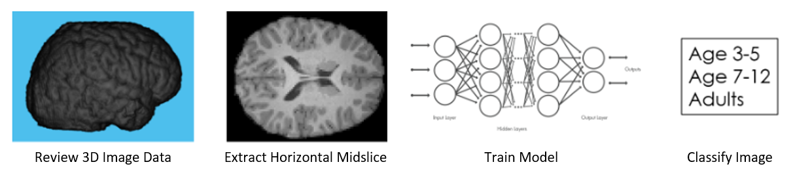

# **Brain MRI Age Classification Using Deep Learning**

This example shows how to work with an MRI brain image dataset and how to use transfer learning to modify and retrain ResNet-18, a pretrained convolutional neural network, to perform image classification on that dataset.

The MRI scans used in this example were obtained during a study \[1\] of social brain development conducted by researchers at the Massachussets Institute of Technology (MIT), and are available for download via the OpenNEURO platform:
    https://openneuro.org/datasets/ds000228/versions/1.1.0

This example works with the horizontal midslice images from the brain MRI scan volumes and shows how these images can be classified into 3 categories according to the chronological age of the participant:
1. Participants Aged 3-5
2. Participants Aged 7-12
3. Participants older than 18, classified as Adults

This example works though multiple steps of a deep learning workflow:
- _Exploring_ a public brain MRI image dataset
- _Preparing_ the dataset for deep learning
- _Training_ a deep learning model to perform chronological age classification
- _Evaluating_ the trained model

## **Getting the Data**

The dataset is available for download via the OpenNEURO data sharing platform. 

Steps: 
1. Download OpenNeuro dataset: https://openneuro.org/datasets/ds000228/versions/1.1.0 
2. Copy dataset folder to the code root folder.

## **Running the Code**

To run:
1. Open `BrainMRIAgeClassificationUsingDeepLearning.mlx`
2. Run `BrainMRIAgeClassificationUsingDeepLearning.mlx`

Requires:
- [MATLAB](https://www.mathworks.com/products/matlab.html)
- [Deep Learning Toolbox](https://www.mathworks.com/products/deep-learning.html)
- [Image Processing Toolbox](https://www.mathworks.com/products/image.html)

## **References**
\[1\] Richardson, H., Lisandrelli, G., Riobueno-Naylor, A., & Saxe, R. (2018). Development of the social brain from age three to twelve years. Nature Communications, 9(1), 1027. https://www.nature.com/articles/s41467-018-03399-2 

Copyright 2020 The MathWorks, Inc.
